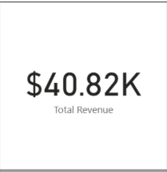
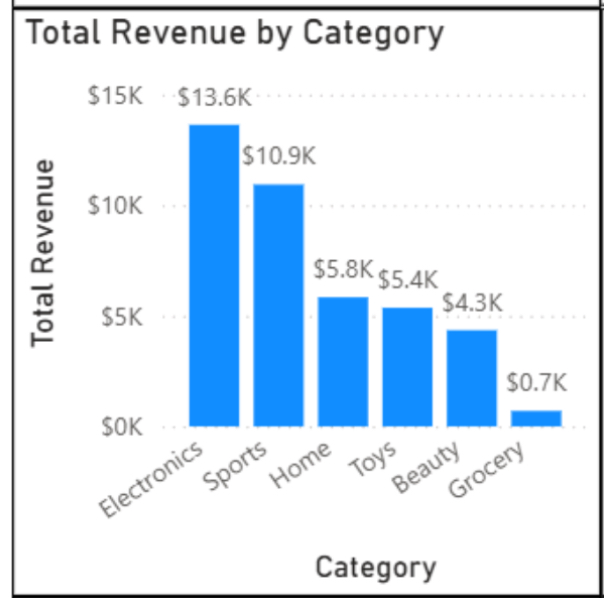
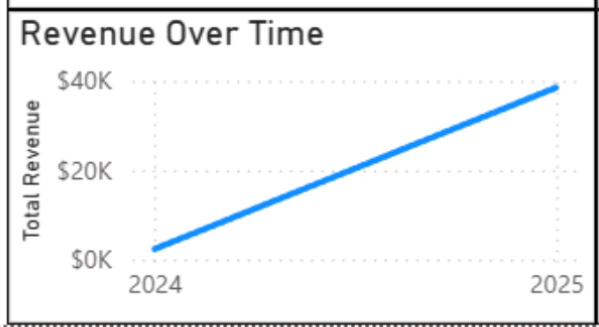
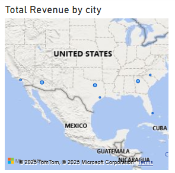
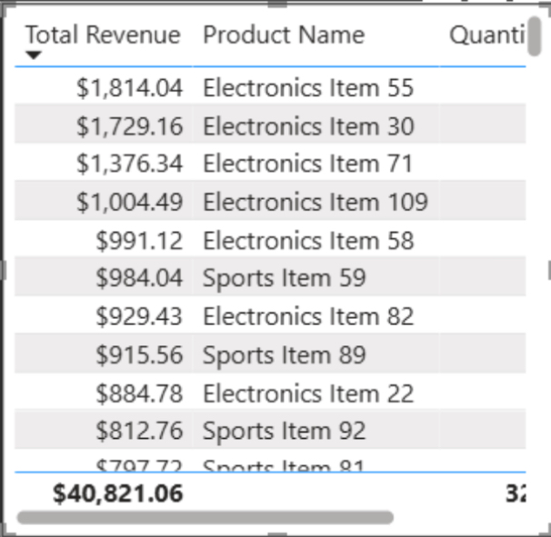
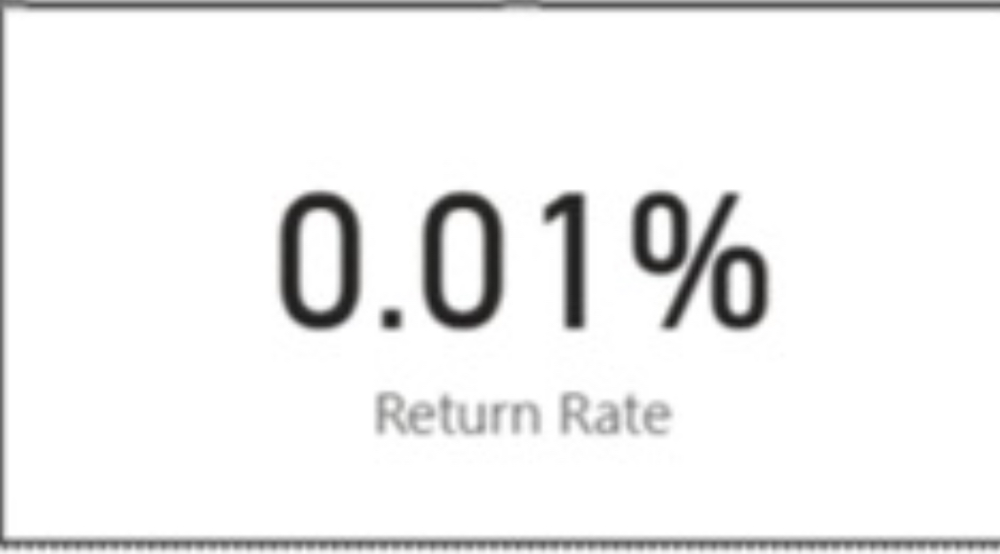

# 📦 E-Commerce Operations Analytics  
### **SQL • Data Cleaning • Business Insights • Power BI Dashboard**

This project analyzes a fictional e-commerce company’s operational performance across **customers, orders, products, order items, returns, inventory, and shipments**.

It demonstrates an end-to-end analytics workflow:  
**raw CSVs → cleaned datasets → SQLite database → SQL insights → Power BI dashboard → business recommendations.**

---

## 📌 Project Goals

Simulate real-world work performed by Data Analysts in:

- E-commerce  
- Operations & logistics  
- Customer analytics  
- Sportsbook-style operations teams (similar analytical workflow)

### 🎯 Objectives
1. Clean, validate, and structure multiple raw CSV files.  
2. Build a relational SQLite database (**ecommerce_ops.db**).  
3. Write SQL queries to answer real business questions.  
4. Understand customer behavior, category revenue drivers, returns, and shipping efficiency.  
5. Present insights clearly through markdown summaries and Power BI visualizations.

---

## 🧰 Tools & Skills Demonstrated

- **SQL (SQLite)** – joins, aggregations, filtering, window functions, HAVING clauses  
- **Python / Pandas** – data cleaning, preprocessing, ETL  
- **Jupyter Notebook** – analysis workflow & documentation  
- **Power BI** – dashboards & KPIs  
- **Data Modeling** – star-schema creation  
- **KPI Development** – operational metrics used in real analyst roles  
- **Markdown + Storytelling** – insights & recommendations  

---

## 📁 Project Structure

```plaintext
01_ecommerce_ops_analytics/
│
├── data/
│ ├── processed/
│ └── raw/
│
├── 02_docs/
│ ├── 01_project_overview.md
│ ├── 02_methodology.md
│ ├── 03_kpis.md
│ └── 04_findings.md
│
├── 03_notebooks/
│ ├── 01_data_exploration.ipynb
│ ├── 02_data_cleaning.ipynb
│ └── 03_sales_analysis.ipynb
│
├── 04_sql/
│ ├── 01_create_tables.sql
│ ├── 02_queries.sql
│ └── 03_analysis.sql
│
├── 05_visuals/
│ ├── Full_View_Dashboard.png
│ ├── Return_Rate.png
│ ├── Revenue_Over_Time.png
│ ├── Total_Revenue_by_category.png
│ ├── Total_Revenue_by_city.png
│ ├── Total_Revenue_by_product.png
│ └── Total_Revenue.png
│
├── 06_powerbi/
│ └── Ecommerce_Ops_Analytics_Dashboard.pbix
│
├── LICENSE
└── README.md
```

---

## 🧼 Data Cleaning Summary

All raw datasets were cleaned with Python/Pandas:

- Standardized column names  
- Fixed inconsistent casing  
- Removed unnecessary whitespace  
- Converted data types  
- Repaired numeric formatting  
- Validated `customer_id`, `order_id`, `product_id` relationships  
- Built a complete relational database: **ecommerce_ops.db**

Detailed cleaning steps live in **`02_data_cleaning.ipynb`**.

---

## 📊 Power BI Dashboard

A complete operational dashboard was built using the cleaned datasets.  
It includes revenue insights, product category performance, return behavior, and geographic sales trends.

### 🔹 Full Dashboard  


---

## 📈 Key Visuals (Power BI)

### **1️⃣ Total Revenue**


### **2️⃣ Revenue by Category**


### **3️⃣ Revenue Over Time**


### **4️⃣ Revenue by City**


### **5️⃣ Top Revenue-Generating Products**


### **6️⃣ Return Rate KPI**


### 📥 Power BI File  
Download or explore the dashboard:
06_powerbi/Ecommerce_Ops_Analytics_Dashboard.pbix


---

## 🔍 Key Business Questions Answered

Queries and insights include:

1. Top 10 customers by total revenue.
2. Average Order Value (AOV) from delivered orders only.
3. Products that have generated more than $1,000 in total net revenue.
--     (delivered orders only)  
4. Customers with ≥ 3 orders in the last 90 days
--     (based on order_date relative to current date)
5. For each product category, total units sold and total revenue.
--     (delivered orders only) 
6. Which warehouse has the fastest average delivery time?
7. Identify all orders that had discounts applied AND were later returned.  
8. For each customer, calculate their most recent order date. 
9. What percentage of orders were cancelled in the last 60 days? 
10. Top 3 carriers by on-time delivery rate.

All SQL is located in **`04_sql/03_analysis.sql`**.

---

## 📌 Example Insights

- **Electronics** and **Sports** drive the majority of revenue.  
- **Beauty** sells the most units but contributes low revenue due to low price point.  
- **Return Rate = 0.17%**, well within normal operational range.  
- Revenue increased consistently **from 2024 → 2025**.  
- Sales are widely distributed across major U.S. cities.  

---

## 🚀 Next Steps

- Build customer segmentation using **RFM Analysis**  
- Expand SQL using window functions for deeper insights  
- Add forecasting models (purchase probability, return likelihood)  
- Begin a second analytics project to expand portfolio depth  

---

## 👋 Contact

**Jaylund Harris**  
Aspiring Data Analyst • SQL • Python • Operations Analytics  
Email: **jaylundharris@gmail.com**  
GitHub: https://github.com/Jaylundharris  
LinkedIn: https://www.linkedin.com/in/jaylund-harris-571936384/

---

## ⭐ Why This Project Matters

This project was created to demonstrate the **four essential analytics skills**:

1. **Data Cleaning (Python)**  
2. **SQL Querying**  
3. **Analytical Thinking & KPIs**  
4. **Business Communication**  

A complete end-to-end workflow — the same structure used in real analyst roles.

---
